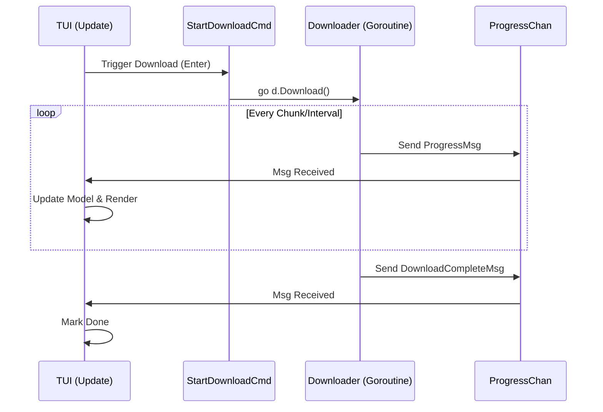

# Surge TUI Architecture

This document outlines the architecture of the Terminal User Interface (TUI) for Surge, built using The Elm Architecture (TEA) via the `bubbletea` framework.

## Overview

The TUI is organized into the standard TEA triplet:
1.  **Model**: [RootModel](model.go#L39-L51) stores the application state.
2.  **View**: [View()](view.go#L12-L93) renders the UI as a string.
3.  **Update**: [Update()](update.go#L14-L170) handles messages and state transitions.

## Core Components

### 1. Model ([internal/tui/model.go](model.go))

The [RootModel](model.go#L39-L51) is the top-level state container.

```go
type RootModel struct {
    downloads    []*DownloadModel  // List of active downloads
    width        int               // Terminal width
    height       int               // Terminal height
    state        UIState           // Current UI mode (Dashboard, Input, Detail)
    inputs       []textinput.Model // Input fields for adding downloads
    cursor       int               // Index of selected download
    progressChan chan tea.Msg      // Channel for async download updates
}
```

The [DownloadModel](model.go#L21-L38) represents a single download task.
```go
type DownloadModel struct {
    ID, URL, Filename string
    Total, Downloaded int64
    Speed             float64
    progress          progress.Model // Bubble Tea progress bar component
    // ...
}
```

### 2. View ([internal/tui/view.go](view.go))

The View function renders the UI based on `RootModel.state`.

*   **Dashboard State**:
    *   **Header**: Displays "Surge" title and aggregate stats (Active, Queued, Downloaded).
    *   **List**: Renders a scrollable list of "Cards". Each card shows the filename, progress bar, and active stats (Speed, ETA).
    *   **Status Bar**: Shows keybindings and total speed.

*   **Detail State**:
    *   Shows a full-screen view of the selected download with comprehensive metadata (URL, precise byte counts, connection details).
    *   Triggered by pressing `Enter` on a dashboard card.

*   **Input State**:
    *   A popup modal for adding a new download (URL and Output Path).

### 3. Update Loop ([internal/tui/update.go](update.go))

The [Update](update.go#L14-L170) function handles:
*   **Key Messages**: Navigation (`Up/Down/k/j`), Mode switching (`g` for add, `Enter` for details/start, `Esc` for back).
*   **Window Size**: Updates `width` and `height` on terminal resize to ensure responsive layout.
*   **Download Messages**:
    *   `DownloadStartedMsg`: Initializes a new download in the model.
    *   `ProgressMsg`: Updates bytes downloaded and speed.
    *   `DownloadCompleteMsg` / `DownloadErrorMsg`: Finalizes download state.

### 4. Styles ([internal/tui/styles.go](styles.go))

Styling is handled by `lipgloss`.
*   **Themes**: Uses a Dracula-inspired color palette (Purple, Pink, Green for success).
*   **Components**: Pre-defined styles for `CardStyle`, `HeaderStyle`, `SelectedCardStyle` ensure consistent look and feel.

## Async Download Handling

Downloads run in their own goroutines (managed by the `downloader` package). They communicate back to the TUI via a `tea.Msg` channel (`progressChan`).

1.  **Start**: TUI creates a [StartDownloadCmd](update.go#L171-L189).
2.  **Execute**: This command launches a goroutine calling `d.Download()`.
3.  **Update**: The downloader pushes `messages.ProgressMsg` to the channel.
4.  **Render**: [Update()](update.go#L14-L170) receives the message, updates the [DownloadModel](model.go#L21-L38), and triggers a re-render.

## Sequence Diagram



